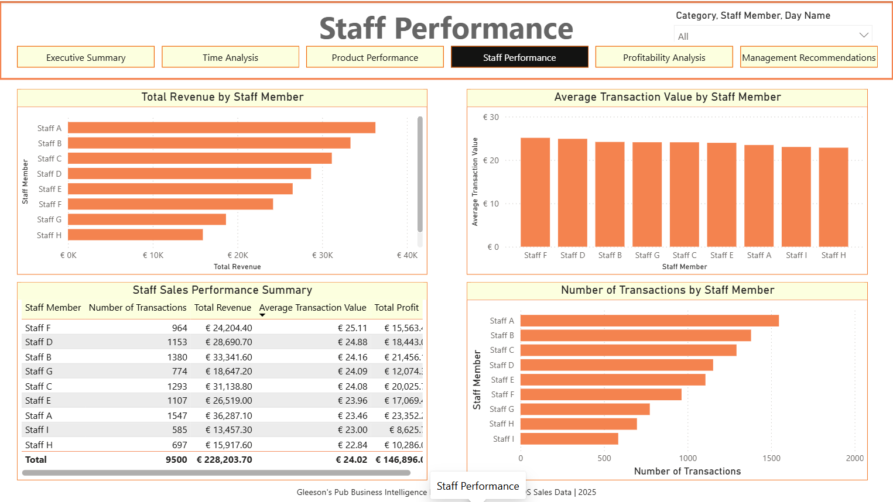
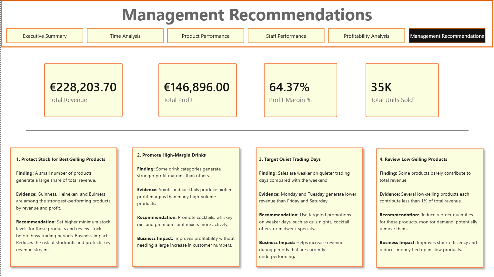

# Gleesons Pub Sales Analytics Dashboard


## Project Overview

This project is a Power BI dashboard built to analyse POS sales data from Gleesons, the pub I work in.

I created it to answer basic business questions and introduce simple analytics into a business that previously had none.

The main aim was to make sales data easier to understand and use it to support decisions within the pub.

The dashboard was originally built using real POS sales data from Gleesons. For privacy reasons, the real dataset is not included in this public repository. A simulated dataset is included to show how the dashboard works.


## Why Did I Build This?

Gleesons had an abundance of useful sales data available through its POS system, but it was not being used for analysis.

I wanted to use Power BI and the analysis skills I had developed to answer some key questions:

* Which products are performing the best?
* What hours are busiest? 
* Which products are worth keeping?
* Can sales data support better product decisions?

The project was built to turn raw POS data into a simple dashboard that could support decision-making.


## Core Finding: Beamish vs Guinness

The main finding from the dashboard was that Beamish appeared to be taking sales away from Guinness.

Beamish was introduced in early December 2025. After it was introduced, Guinness sales started to decline.

When I compared the months from January to May, the revenue gained from Beamish roughly offset the revenue lost from Guinness. However, Beamish generated around 11% less revenue per pint than Guinness. This insight was clearly visible on the dashboard.

This suggested that Beamish was not creating much additional revenue. Instead, it appeared to be replacing Guinness sales with a lower revenue product.

As a result, Beamish was removed from the pub in July 2026.


## Business Impact

This project had a real impact because it was based on sales data from Gleesons, specifically from September 2025 to May 2026.

The dashboard helped show that:

* Beamish was taking sales away from Guinness.
* Beamish generated around 11% less revenue per pint than Guinness.
* The sales gained from Beamish roughly offset the sales lost from Guinness.
* Keeping Beamish meant shifting sales away from a stronger-performing product.

This supported the decision to remove Beamish from the pub and focus on Guinness as the stronger performing drink.


## Recommendation

The main recommendation was to remove Beamish and protect Guinness as one of the pub’s best products.

The reason was simple:

Beamish appeared to replace Guinness sales rather than add meaningful new sales, while generating less revenue per pint.

This made Beamish a simply weaker product.


## Dataset

The dashboard was developed using real POS sales data from Gleesons.

The real dataset is not included in this GitHub repository because it contains private business information. Instead, I have included a simulated dataset with the same structure.

The public dataset includes fields such as:

* Transaction ID
* Date
* Time
* Product Name
* Category
* Quantity
* Sale Price
* Cost Price
* Staff Member
* Revenue
* Cost
* Profit


## Data Privacy

The original POS data from Gleesons has been excluded from this public version.

No customer data, payment information, or private business figures are shared.

The public dataset is simulated and is included to demonstrate the dashboard structure and analysis approach.


## Tools Used

* Power BI
* Power Query
* DAX
* CSV / Excel
* GitHub


## Dashboard Pages

The dashboard includes six pages:

1. Executive Summary
2. Product Performance
3. Time-Based Sales Analysis
4. Staff Performance
5. Profitability Analysis
6. Management Recommendations


## What the Dashboard Shows

### Executive Summary

A quick overview of the main KPIs:

* Total Revenue
* Total Profit
* Number of Transactions
* Average Transaction Value
* Total Units Sold


### Product Performance

Shows which products are performing best and worst.

This includes:

* Top products by revenue
* Top products by units sold
* Top products by profit
* Product category performance


### Time-Based Sales Analysis

Shows when the pub is busiest.

This includes:

* Revenue by hour
* Revenue by day
* Monthly trends
* Busy and quiet trading periods


### Staff Performance

Shows sales activity by staff member.

This includes:

* Revenue processed
* Number of transactions
* Average transaction value

This page is used as an overview only, as staff results can depend on which shifts they worked.


### Profitability Analysis

Looks at profit rather than just sales.

This helps show:

* Which products make the most profit
* Which products have weaker performance
* Whether new products are adding sales or taking sales from stronger products


### Management Recommendations

This page summarises the main action from the analysis:


## Repository Structure

```text
gleesons-pub-sales-dashboard/
│
├── data/
│   └── pub_sales_data_no_food.csv
│
├── powerbi/
│   └── pub_business_dashboard_public.pbix
│
├── report/
│   └── pub_business_insights_report.pdf
│
├── screenshots/
│   ├── executive_summary.png
│   ├── product_performance.png
│   ├── time_analysis.png
│   ├── staff_performance.png
│   ├── profitability_analysis.png
│   └── management_recommendations.png
│
└── README.md
```


## Screenshots

### Executive Summary


### Product Performance


### Time-Based Sales Analysis


### Staff Performance



### Profitability Analysis


### Management Recommendations




## How to Use This Project

1. Download or clone the repository.
2. Open the Power BI file in Power BI Desktop.
3. Use the navigation buttons to move between pages.
4. Use the slicers to filter the data.
5. Read the report for a short summary of the finding and recommendation.


## Future Improvements

Possible future improvements include:

* Connecting the dashboard to regular POS exports
* Adding automatic refresh
* Adding stock/inventory data
* Adding sales targets
* Reviewing future product launches using the same approach

---

